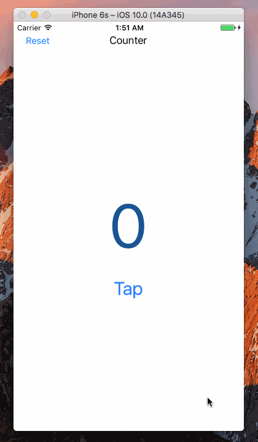

# SampleCode
All of the code examples are here

### [Swift-Project-03](https://github.com/NSMichael/SampleCode/tree/master/Swift-Project-03)
##### SWIFT IAD

### [Swift-Project-02](https://github.com/NSMichael/SampleCode/tree/master/Swift-Project-02)
##### TAP OR HOLD COUNTER

### [Swift-Project-01](https://github.com/NSMichael/SampleCode/tree/master/Swift-Project-01)
##### TAP COUNTER

### [UIViewAnimationDemo](https://github.com/NSMichael/SampleCode/tree/master/UIViewAnimationDemo) 
##### UIView 基础动画

### [StudentStore](https://github.com/NSMichael/SampleCode/tree/master/StudentStore) 
##### 使用MagicalRecord实现数据增删改查功能

### [AppIntroductionDemo](https://github.com/NSMichael/SampleCode/tree/master/AppIntroductionDemo)
##### iOS APP 新手指导Demo