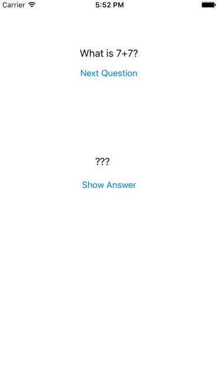
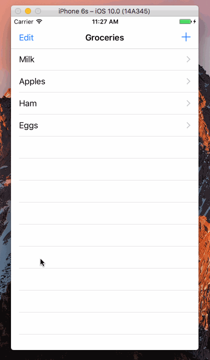
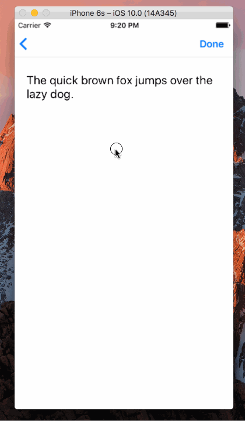
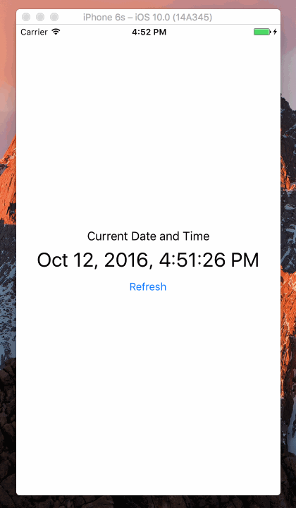
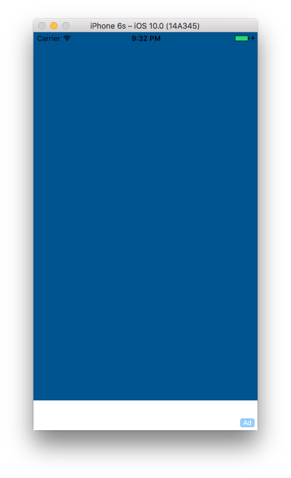

# SampleCode
All of the code examples are here

### [iOS-Programming-Chapter2-Playground](https://github.com/NSMichael/SampleCode/tree/master/iOS-Programming-Chapter2-Playground)
##### The Swift Language

### [iOS-Programming-Chapter1-Quiz](https://github.com/NSMichael/SampleCode/tree/master/iOS-Programming-Chapter1-Quiz)
##### A Simple iOS Application

### [Swift-Project-12](https://github.com/NSMichael/SampleCode/tree/master/Swift-Project-12)
##### ADD NEW ITEM

### [Swift-Project-11](https://github.com/NSMichael/SampleCode/tree/master/Swift-Project-11)
##### DELETING AND REARRANGING

### [Swift-Project-10](https://github.com/NSMichael/SampleCode/tree/master/Swift-Project-10)
##### PULL TO REFRESH TABLE VIEW

### [Swift-Project-09](https://github.com/NSMichael/SampleCode/tree/master/Swift-Project-09)
##### ADD PHOTO FROM CAMERA ROLL

### [Swift-Project-08](https://github.com/NSMichael/SampleCode/tree/master/Swift-Project-08)
##### SWIPE TO DISMISS KEYBOARD

### [Swift-Project-07](https://github.com/NSMichael/SampleCode/tree/master/Swift-Project-07)
##### PASSING DATA TO ANOTHER VIEW

### [Swift-Project-06](https://github.com/NSMichael/SampleCode/tree/master/Swift-Project-06)
##### GETTING CURRENT DATE AND 

### [Swift-Project-05](https://github.com/NSMichael/SampleCode/tree/master/Swift-Project-05)
##### BASIC TABLE VIEW

### [Swift-Project-04](https://github.com/NSMichael/SampleCode/tree/master/Swift-Project-04)
##### TIP CALCULATOR

### [Swift-Project-03](https://github.com/NSMichael/SampleCode/tree/master/Swift-Project-03)
##### SWIFT IAD

### [Swift-Project-02](https://github.com/NSMichael/SampleCode/tree/master/Swift-Project-02)
##### TAP OR HOLD COUNTER

### [Swift-Project-01](https://github.com/NSMichael/SampleCode/tree/master/Swift-Project-01)
##### TAP COUNTER

### [UIViewAnimationDemo](https://github.com/NSMichael/SampleCode/tree/master/UIViewAnimationDemo) 
##### UIView 基础动画

### [StudentStore](https://github.com/NSMichael/SampleCode/tree/master/StudentStore) 
##### 使用MagicalRecord实现数据增删改查功能

### [AppIntroductionDemo](https://github.com/NSMichael/SampleCode/tree/master/AppIntroductionDemo)
##### iOS APP 新手指导Demo