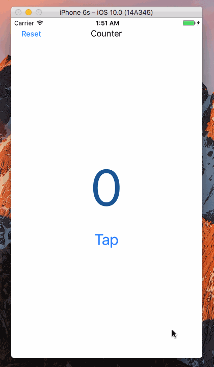

Swift-Project-01
============

#### 主要学习的内容：
- 使用 Interface Builder 来建立标签和按钮
- 编写 Swift function 来增加和重置数字
- 在标签、按钮与代码之间建立关联

#### 开发环境：
- macOS 10.12
- Xcode 8.0
- iOS 10.0
- Swift 3.0

#### 组件：
- [UIKit](https://developer.apple.com/reference/uikit)

#### 参考：
- [Creating a ‘Hello World’ App with Swift](https://www.sitepoint.com/creating-hello-world-app-swift/)

#### 源代码：
- [https://github.com/NSMichael/SampleCode/tree/master/Swift-Project-01](https://github.com/NSMichael/SampleCode/tree/master/Swift-Project-01)

