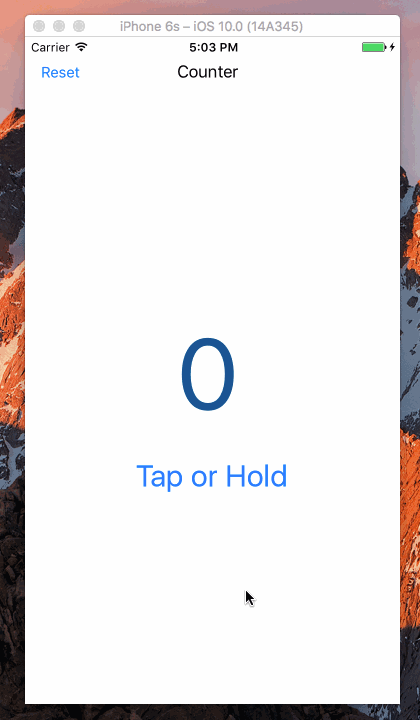

Swift-Project-02
============

#### 主要学习的内容：
- 直接调用 `UIKit` 提供的 `UIGestureRecognizer` 方法
- 代码级别关联 events
- 学习了解 `Selector` 的调用方法
- 学习了解 `Timer` 的使用方法

#### 开发环境：
- macOS 10.12
- Xcode 8.0
- iOS 10.0
- Swift 3.0

#### 组件：
- [Timer](https://developer.apple.com/reference/foundation/timer)
- [UIGestureRecognizer](https://developer.apple.com/reference/uikit/uigesturerecognizer)
   - [UITapGestureRecognizer](https://developer.apple.com/reference/uikit/uitapgesturerecognizer)
   - [UILongPressGestureRecognizer](https://developer.apple.com/reference/uikit/uilongpressgesturerecognizer)

#### 参考：
- [Swift Button tap and long press gesture](http://stackoverflow.com/questions/34548263/swift-button-tap-and-long-press-gesture)
- [Swift Tips - Selector](http://en.swifter.tips/selector/)
- [Swift NSTimer Tutorial – Lets create a Swift Timer (counter) application](https://tommy.net.cn/2016/10/02/swift-project-02-tap-or-hold-counter/)

#### 源代码：
- [https://github.com/NSMichael/SampleCode/tree/master/Swift-Project-02](https://github.com/NSMichael/SampleCode/tree/master/Swift-Project-02)
