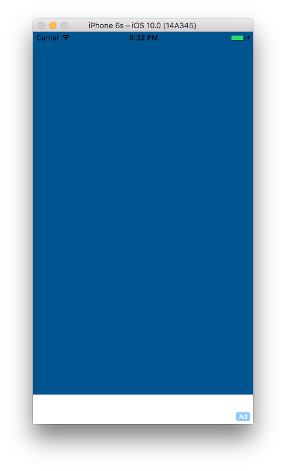

Swift-Project-01
============

>注意：从 2016 年 7 月 1 号开始，Apple 已经关闭了 iAd Network。所以没有办法再写 iAd 相关的东西了。项目中需要把 Target 设置为 9.x 系列。因为从 10.0 开始所有 iAd 相关的 API 都已经被标记为废弃了。还有就是在 Interface Builder 里面也找不到 iAd Banner 了。为了更好的看到 iAd，背景使用了蓝色，大家可以看到底部的 Ad 字样，表示 iAd 已经加载了。

#### 主要学习的内容：
- 添加 `iAd.framework` 到项目中
- 给当前 `View` 添加 `Subview`
- 了解了 `CGRect`

#### 开发环境：
- macOS 10.12
- Xcode 8.0
- iOS 10.0
- Swift 3.0

#### 组件：
- [iAd](https://developer.apple.com/support/iad/)

#### 参考：
- [iAd Tutorial – How To Integrate iAd Banners Into Your App](http://codewithchris.com/iad-tutorial/)

#### 源代码：
- [https://github.com/NSMichael/SampleCode/tree/master/Swift-Project-03](https://github.com/NSMichael/SampleCode/tree/master/Swift-Project-03)

