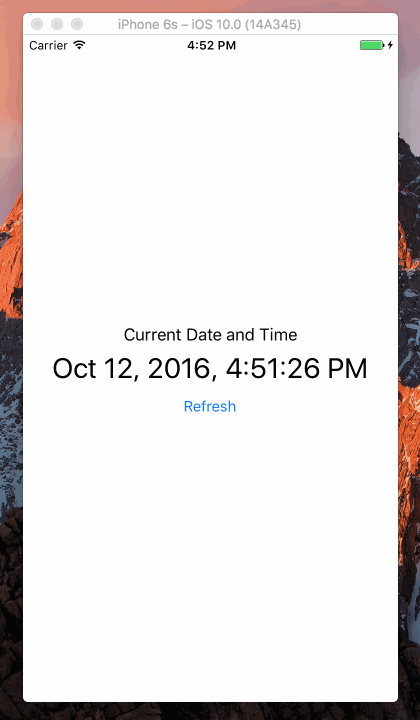

Swift-Project-06
============

#### 主要学习的内容：
- 很多的参考资料都是关于 NSDate 和 NSDateFormatter 的介绍的，这里主要使用了 Swift 3.0 新的 `Date` 和 `DateFormatter` 而不是带 `NS` 前缀的
- 格式化日期和时间输出
- 刷新日期和时间

#### 开发环境：
- macOS 10.12
- Xcode 8.0
- iOS 10.0
- Swift 3.0

#### 组件：
- [Date](https://developer.apple.com/reference/foundation/date)
- [DateFormatter](https://developer.apple.com/reference/foundation/dateformatter)
- [TimeZone](https://developer.apple.com/reference/foundation/timezone)
- [NSDate](https://developer.apple.com/reference/foundation/nsdate)
- [NSDateFormatter](https://developer.apple.com/reference/foundation/nsdateformatter)
- [Drop NS Prefix in Swift Foundation](https://github.com/apple/swift-evolution/blob/master/proposals/0086-drop-foundation-ns.md)

#### 参考：
- [How to get the current time as datetime](http://stackoverflow.com/questions/24070450/how-to-get-the-current-time-as-datetime)
- [Swift 3: Working with dates](https://gist.github.com/stinger/553bdbd7af26f8c43059f8774cbab077)

#### 源代码：
- [https://github.com/NSMichael/SampleCode/tree/master/Swift-Project-06](https://github.com/NSMichael/SampleCode/tree/master/Swift-Project-06)
