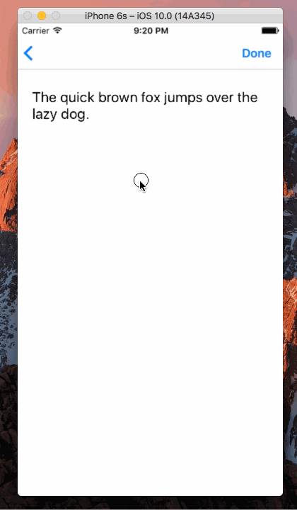

Swift-Project-08
============

#### 主要学习的内容：
- 继重温了一下 UIBarButtonItem
- 学习了解了 UISwipeGestureRecognizer 的用法
- 处理 4 种不同的 swipe 动作
- 赶进一步了解 selector 的用法

#### 开发环境：
- macOS 10.12
- Xcode 8.0
- iOS 10.0
- Swift 3.0

#### 组件：
- [UIBarButtonItem](https://developer.apple.com/reference/uikit/uibarbuttonitem)
- [UISwipeGestureRecognizer](https://developer.apple.com/reference/uikit/uiswipegesturerecognizer)

#### 参考：
- [Dismiss keyboard with swipe gesture](http://stackoverflow.com/questions/30042352/dismiss-keyboard-with-swipe-gesture)
- [Dismiss UITextField Keyboard With Swipe](http://stackoverflow.com/questions/36958911/dismiss-uitextfield-keyboard-with-swipe)
- [How to recognize swipe in all 4 directions](http://stackoverflow.com/questions/24215117/how-to-recognize-swipe-in-all-4-directions)
- [Understanding Swift 2.2 Selector Syntax - #selector()](http://stackoverflow.com/questions/36166248/understanding-swift-2-2-selector-syntax-selector)

#### 源代码：
- [https://github.com/NSMichael/SampleCode/tree/master/Swift-Project-08](https://github.com/NSMichael/SampleCode/tree/master/Swift-Project-08)