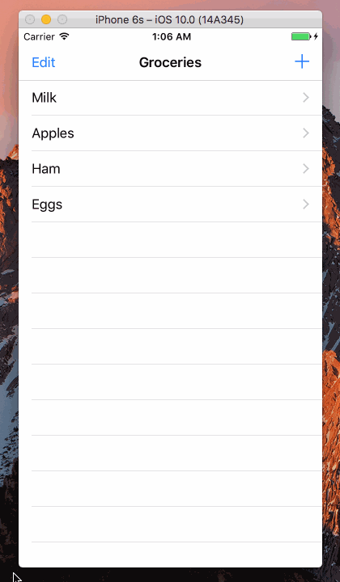

Swift-Project-10
============

#### 主要学习的内容：
- 了解了 UIRefreshControl 的使用方法，它是 TableView 的一个成员，可以在 Storyboard 里面设置是否开启 Refreshing，开启则初始化实例，否则为 nil
- 学会了一种 Swift 3.0 中的延时方式

#### 开发环境：
- macOS 10.12
- Xcode 8.0
- iOS 10.0
- Swift 3.0

#### 组件：
- [UIRefreshControl](https://developer.apple.com/reference/uikit/uirefreshcontrol)

#### 参考：
- [Basics of Pull to Refresh for Swift Developers](https://www.andrewcbancroft.com/2015/03/17/basics-of-pull-to-refresh-for-swift-developers/)
- [How to create an empty array in Swift?](http://stackoverflow.com/questions/30430550/how-to-create-an-empty-array-in-swift)
- [How to program a delay in Swift 3](http://stackoverflow.com/questions/38031137/how-to-program-a-delay-in-swift-3)

#### 源代码：
- [https://github.com/NSMichael/SampleCode/tree/master/Swift-Project-10](https://github.com/NSMichael/SampleCode/tree/master/Swift-Project-10)