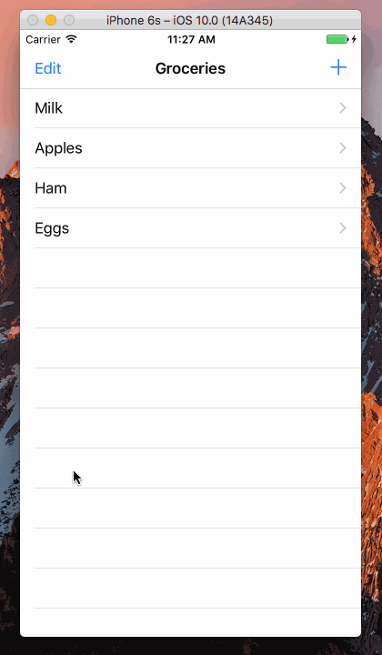

Swift-Project-11
============

#### 主要学习的内容：
- 进一步了解了 UITableViewDelegate 的使用方法
- 删除 table row 的内容
- 删除的时候显示动画
- 处理 Table 显示内容的顺序调整

#### 开发环境：
- macOS 10.12
- Xcode 8.0
- iOS 10.0
- Swift 3.0

#### 组件：
- [UITableViewController](https://developer.apple.com/reference/uikit/uitableviewcontroller)
- [UITableViewDelegate](https://developer.apple.com/reference/uikit/uitableviewdelegate)

#### 参考：
- [Swipe To Delete TableView Row](http://stackoverflow.com/questions/9471642/swipe-to-delete-tableview-row)

#### 源代码：
- [https://github.com/NSMichael/SampleCode/tree/master/Swift-Project-11](https://github.com/NSMichael/SampleCode/tree/master/Swift-Project-11)