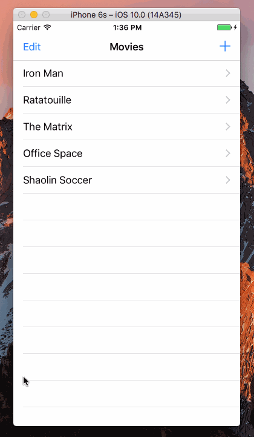

Swift-Project-12
============

#### 主要学习的内容：
- 进一步了解了 TextView 对于键盘的处理，包括如何直接按 “Done” 来完成输入
- 键盘界面上 Return 变为 Done
- 处理了一个 Xcode 8 / Swift 3 NavigationController PopView 的 warning
- 在之前单向推送数据的基础上，了解了如何把数据反向传回上一级 Controller（用 Delegate）

#### 开发环境：
- macOS 10.12
- Xcode 8.0
- iOS 10.0
- Swift 3.0

#### 组件：
- [UITableViewController](https://developer.apple.com/reference/uikit/uitableviewcontroller)
- [UINavigationController](https://developer.apple.com/reference/uikit/uinavigationcontroller)
- [UITextView](https://developer.apple.com/reference/uikit/uitextview)

#### 参考：
- [How do I give a UITextView focus programatically?](http://stackoverflow.com/questions/987975/how-do-i-give-a-uitextview-focus-programatically)
- [Change ‘Return’ button function to ‘Done’ in swift in UITextView](http://stackoverflow.com/questions/31886720/change-return-button-function-to-done-in-swift-in-uitextview)
- [Xcode 8 / Swift 3: “Expression of type UIViewController? is unused” warning](http://stackoverflow.com/questions/37843049/xcode-8-swift-3-expression-of-type-uiviewcontroller-is-unused-warning)
- [How to pass data between two view controllers](https://www.hackingwithswift.com/example-code/system/how-to-pass-data-between-two-view-controllers)

#### 源代码：
- [https://github.com/NSMichael/SampleCode/tree/master/Swift-Project-12](https://github.com/NSMichael/SampleCode/tree/master/Swift-Project-12)