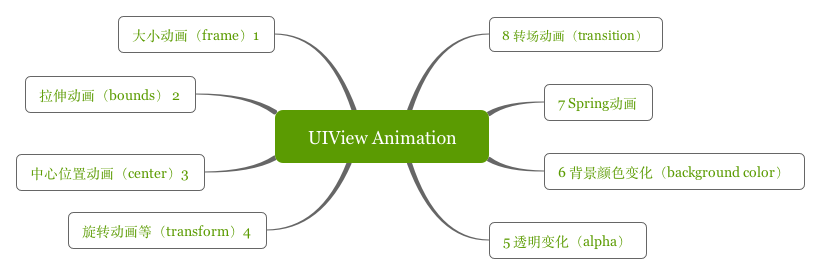
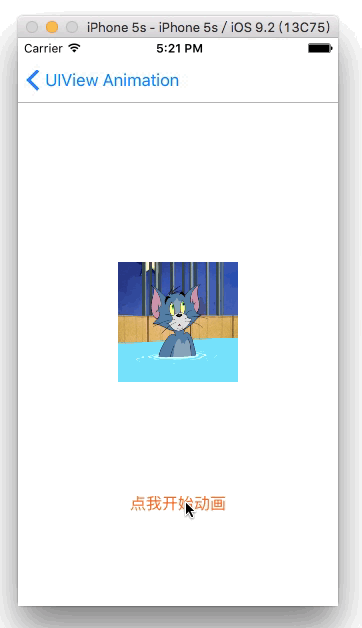
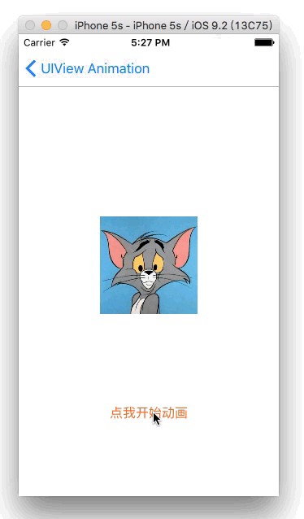
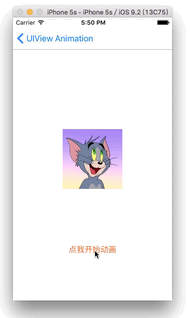
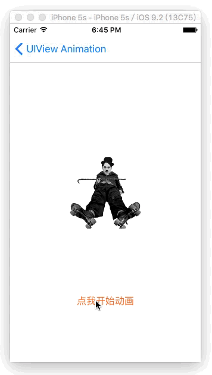
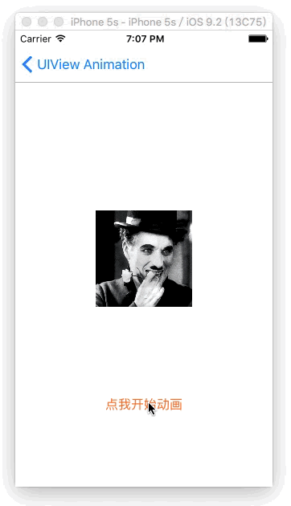
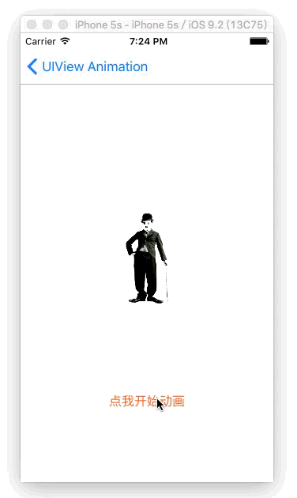
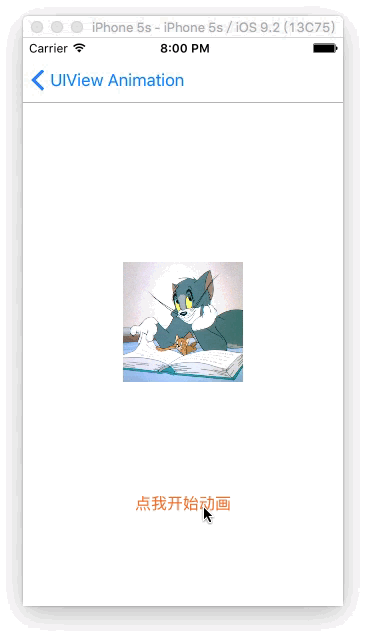
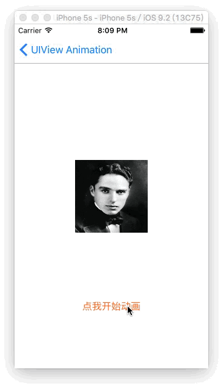
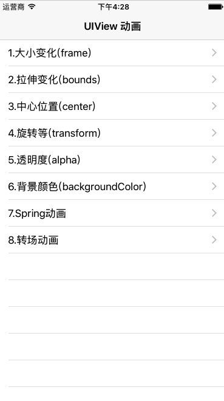

# UIView 基础动画



### 1.大小动画（改变frame）
``` python
- (void)changeFrame {
    
    CGRect originalRect = self.imageView.frame;
    CGRect rect = CGRectMake(self.imageView.frame.origin.x-20, self.imageView.frame.origin.y-120, 160, 80);
    
    [UIView animateWithDuration:1 animations:^{
        self.imageView.frame = rect;
    } completion:^(BOOL finished) {
       [UIView animateWithDuration:1 animations:^{
           self.imageView.frame = originalRect;
       }];
    }];
}
```


### 2.拉伸动画（改变bounds）
``` python
- (void)changeBounds {
    
    CGRect originalBounds = self.imageView.bounds;
    CGRect rect = CGRectMake(0, 0, 300, 120);
    
    [UIView animateWithDuration:1 animations:^{
        self.imageView.bounds = rect;
    } completion:^(BOOL finished) {
       [UIView animateWithDuration:1 animations:^{
           self.imageView.bounds = originalBounds;
       }];
    }];
}
```


### 3.转移动画（改变center）
``` python
- (void)changeCenter {
    CGPoint originalPoint = self.imageView.center;
    CGPoint point = CGPointMake(self.imageView.center.x, self.imageView.center.y-170);
    
    [UIView animateWithDuration:1 animations:^{
        self.imageView.center = point;
    } completion:^(BOOL finished) {
       [UIView animateWithDuration:1 animations:^{
           self.imageView.center = originalPoint;
       }];
    }];
}
```


### 4.旋转动画(改变transform)
``` python
- (void)transform {
    
    CGAffineTransform originalTrnasform = self.imageView.transform;
    
    [UIView animateWithDuration:1 animations:^{
        
        // 缩放
        // self.imageView.transform = CGAffineTransformMakeScale(0.6, 0.6);
        
        // 平移
        // self.imageView.transform = CGAffineTransformMakeTranslation(60, -60);
        
        // 旋转
        self.imageView.transform = CGAffineTransformMakeRotation(4.0);
        
    } completion:^(BOOL finished) {
       [UIView animateWithDuration:1 animations:^{
           self.imageView.transform = originalTrnasform;
       }];
    }];
}
```


### 5.透明度动画(改变alpha)
``` python
- (void)alpha {
    
    [UIView animateWithDuration:1 animations:^{
        self.imageView.alpha = 0.2;
    } completion:^(BOOL finished) {
       [UIView animateWithDuration:1 animations:^{
           self.imageView.alpha = 1;
       }];
    }];
}
```


### 6.背景颜色Keyframes动画（改变background）
``` python
- (void)changeBackground {
    [UIView animateKeyframesWithDuration:9.0 delay:0.f options:UIViewKeyframeAnimationOptionCalculationModeLinear animations:^{
        [UIView addKeyframeWithRelativeStartTime:0.f relativeDuration:1.0 / 4 animations:^{
            self.imageView.backgroundColor = [UIColor colorWithRed:0.9475 green:0.1921 blue:0.1746 alpha:1.0];
        }];
        [UIView addKeyframeWithRelativeStartTime:1.0 / 4 relativeDuration:1.0 / 4 animations:^{
            self.imageView.backgroundColor = [UIColor colorWithRed:0.1064 green:0.6052 blue:0.0334 alpha:1.0];
        }];
        [UIView addKeyframeWithRelativeStartTime:2.0 / 4 relativeDuration:1.0 / 4 animations:^{
            self.imageView.backgroundColor = [UIColor colorWithRed:0.1366 green:0.3017 blue:0.8411 alpha:1.0];
        }];
        [UIView addKeyframeWithRelativeStartTime:3.0 / 4 relativeDuration:1.0 / 4 animations:^{
            self.imageView.backgroundColor = [UIColor colorWithRed:0.619 green:0.037 blue:0.6719 alpha:1.0];
        }];
        [UIView addKeyframeWithRelativeStartTime:3.0 / 4 relativeDuration:1.0 / 4 animations:^{
            self.imageView.backgroundColor = [UIColor whiteColor];
        }];
    } completion:^(BOOL finished) {
        NSLog(@"动画结束");
    }];
}
```


### 7.Spring动画（iOS7.0起）
``` python
- (void)springAnimation {
    
    CGRect originalRect = self.imageView.frame;
    CGRect rect = CGRectMake(self.imageView.frame.origin.x - 80, self.imageView.frame.origin.y, 120, 120);
    
    [UIView animateWithDuration:0.4 delay:0 usingSpringWithDamping:0.5 initialSpringVelocity:4 options:UIViewAnimationOptionCurveLinear animations:^{
        
        self.imageView.frame = rect;
        
    } completion:^(BOOL finished) {
       
        [UIView animateWithDuration:1 delay:1 usingSpringWithDamping:0.5 initialSpringVelocity:4 options:UIViewAnimationOptionCurveLinear animations:^{
            
            self.imageView.frame = originalRect;
            
        } completion:^(BOOL finished) {
            
        }];
    }];
}
```


### 8.transition动画
``` python
-(void)transitionAnimation {
    [UIView transitionWithView:self.imageView duration:2.0 options:UIViewAnimationOptionTransitionFlipFromLeft animations:^{
        
    } completion:^(BOOL finished) {
       
        [UIView transitionWithView:self.imageView duration:2.0 options:UIViewAnimationOptionTransitionFlipFromRight animations:^{
            
        } completion:^(BOOL finished) {
            
        }];
    }];
}
```


### 9.关于参数option选择说明
#### (1) UIViewAnimationOptions
``` python
UIViewAnimationOptionLayoutSubviews            //进行动画时布局子控件
UIViewAnimationOptionAllowUserInteraction      //进行动画时允许用户交互
UIViewAnimationOptionBeginFromCurrentState     //从当前状态开始动画
UIViewAnimationOptionRepeat                    //无限重复执行动画
UIViewAnimationOptionAutoreverse               //执行动画回路
UIViewAnimationOptionOverrideInheritedDuration //忽略嵌套动画的执行时间设置
UIViewAnimationOptionOverrideInheritedCurve    //忽略嵌套动画的曲线设置
UIViewAnimationOptionAllowAnimatedContent      //转场：进行动画时重绘视图
UIViewAnimationOptionShowHideTransitionViews   //转场：移除（添加和移除图层的）动画效果
UIViewAnimationOptionOverrideInheritedOptions  //不继承父动画设置

UIViewAnimationOptionCurveEaseInOut            //时间曲线，慢进慢出（默认值）
UIViewAnimationOptionCurveEaseIn               //时间曲线，慢进
UIViewAnimationOptionCurveEaseOut              //时间曲线，慢出
UIViewAnimationOptionCurveLinear               //时间曲线，匀速

UIViewAnimationOptionTransitionNone            //转场，不使用动画
UIViewAnimationOptionTransitionFlipFromLeft    //转场，从左向右旋转翻页
UIViewAnimationOptionTransitionFlipFromRight   //转场，从右向左旋转翻页
UIViewAnimationOptionTransitionCurlUp          //转场，下往上卷曲翻页
UIViewAnimationOptionTransitionCurlDown        //转场，从上往下卷曲翻页
UIViewAnimationOptionTransitionCrossDissolve   //转场，交叉消失和出现
UIViewAnimationOptionTransitionFlipFromTop     //转场，从上向下旋转翻页
UIViewAnimationOptionTransitionFlipFromBottom  //转场，从下向上旋转翻页
```

#### (2) UIViewKeyframeAnimationOptions
``` python
UIViewAnimationOptionLayoutSubviews           //进行动画时布局子控件
UIViewAnimationOptionAllowUserInteraction     //进行动画时允许用户交互
UIViewAnimationOptionBeginFromCurrentState    //从当前状态开始动画
UIViewAnimationOptionRepeat                   //无限重复执行动画
UIViewAnimationOptionAutoreverse              //执行动画回路
UIViewAnimationOptionOverrideInheritedDuration //忽略嵌套动画的执行时间设置
UIViewAnimationOptionOverrideInheritedOptions //不继承父动画设置

UIViewKeyframeAnimationOptionCalculationModeLinear     //运算模式 :连续
UIViewKeyframeAnimationOptionCalculationModeDiscrete   //运算模式 :离散
UIViewKeyframeAnimationOptionCalculationModePaced      //运算模式 :均匀执行
UIViewKeyframeAnimationOptionCalculationModeCubic      //运算模式 :平滑
UIViewKeyframeAnimationOptionCalculationModeCubicPaced //运算模式 :平滑均匀
```
就UIView的动画而言，UIViewKeyframeAnimationOptions紧在Keyframes，其余的都是UIViewAnimationOptions。

### 10.总结和扩展
- UIView动画主要是变化UIView的自带属性
- UIView动画可以有很多种方式实现同一效果
- Spring动画iOS7.0以上才有
- UIViewKeyframeAnimationOptions用着Keyframes动画，其余都用UIViewAnimationOptions枚举

### 源码
Demo下载地址：[UIViewAnimationDemo ](https://github.com/NSMichael/SampleCode/tree/master/UIViewAnimationDemo)



