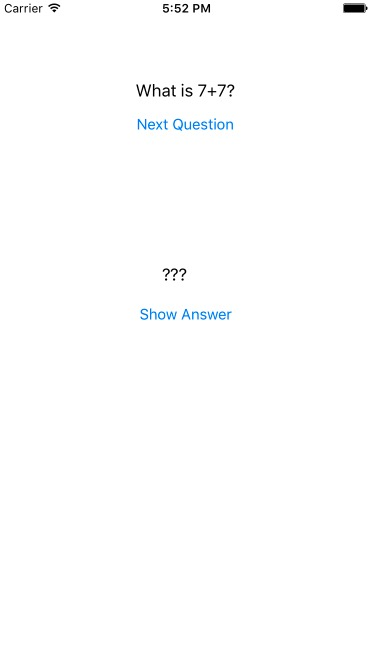
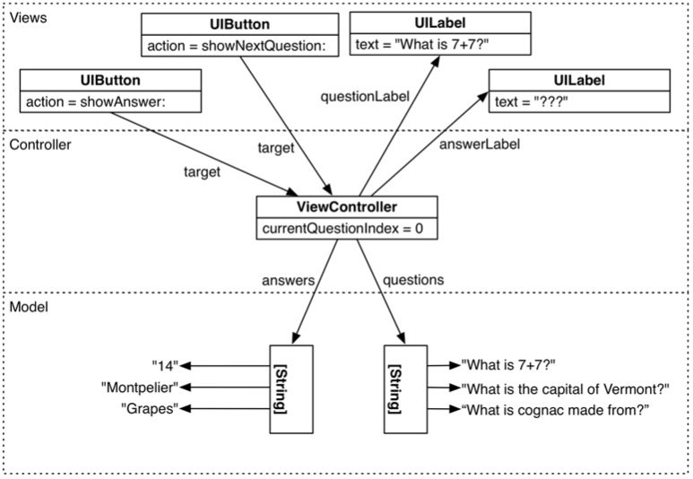
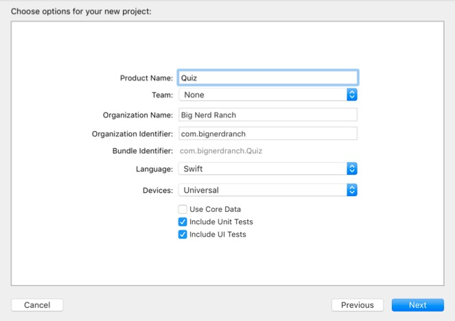
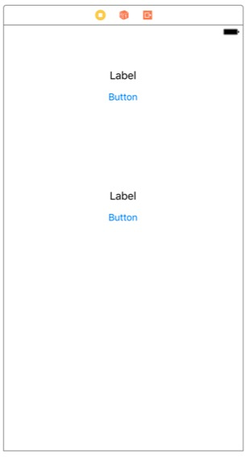
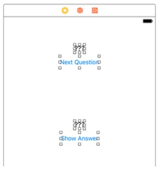
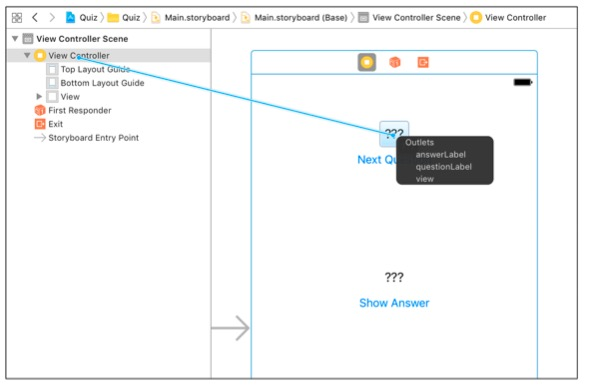
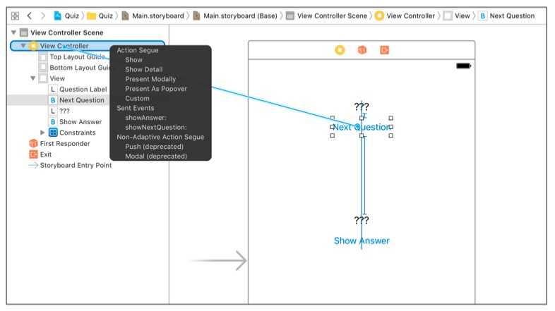

iOS-Programming-Chapter1-Quiz
============

<div align=center>

</div>

#### 项目介绍
知识竞赛简易版APP，运行Demo显示题目，可以选择下一题，也可以查看当前题目的答案。

#### 开发初探
- (0) 设计思路
<div align=center>

</div>
- (1) 新建项目
<div align=center>

</div>
- (2) 界面设计
<div align=center>

</div>
- (3)双击 重命名组建显示名称
<div align=center>

</div>
- (4) 变量声明

```
import UIKit
class ViewController: UIViewController {
    @IBOutlet var questionLabel: UILabel!
    @IBOutlet var answerLabel: UILabel!
}
```
- (5)建立连接
<div align=center>

</div>

- (6)定义按钮点击方法

```
class ViewController: UIViewController {
    @IBOutlet var questionLabel: UILabel!
    @IBOutlet var answerLabel: UILabel!
    @IBAction func showNextQuestion(_ sender: UIButton) {
    }
    @IBAction func showAnswer(_ sender: UIButton) {
    }
}
```
- (7) 建立按钮点击事件连接
<div align=center>

</div>

- (8) 数据源配置、按钮方法实现

```
class ViewController: UIViewController {
    @IBOutlet var questionLabel: UILabel!
    @IBOutlet var answerLabel: UILabel!
    let questions: [String] = [
        "What is 7+7?",
        "What is the capital of Vermont?",
        "What is cognac made from?"
    ]
    let answers: [String] = [
        "14",
        "Montpelier",
		  "Grapes" ]
    var currentQuestionIndex: Int = 0
}

@IBAction func showNextQuestion(_ sender: UIButton) {
    currentQuestionIndex += 1
    if currentQuestionIndex == questions.count {
        currentQuestionIndex = 0
    }
    let question: String = questions[currentQuestionIndex]
    questionLabel.text = question
    answerLabel.text = "???"
}
@IBAction func showAnswer(_ sender: UIButton) {
    let answer: String = answers[currentQuestionIndex]
    answerLabel.text = answer
}

class ViewController: UIViewController {
    ...
    override func viewDidLoad() {
        super.viewDidLoad()
        questionLabel.text = questions[currentQuestionIndex]
    }
}
```

#### 开发环境：
- macOS 10.12
- Xcode 8.3
- iOS 10.3
- Swift 3.0

#### 组件：
- [UILabel](https://developer.apple.com/reference/uikit/uilabel)
- [UIButton](https://developer.apple.com/reference/uikit/uibutton)

#### 源代码：
- [https://github.com/NSMichael/SampleCode/tree/master/iOS-Programming-Chapter1-Quiz](https://github.com/NSMichael/SampleCode/tree/master/iOS-Programming-Chapter1-Quiz)