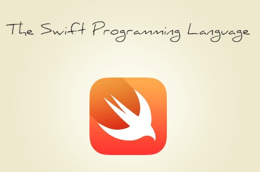

iOS-Programming-Chapter2 The Swift Language
============

<div align=center>

</div>

#### 简介
- Swift，苹果于2014年WWDC（苹果开发者大会）发布的新开发语言，可与Objective-C*共同运行于Mac OS和iOS平台，用于搭建基于苹果平台的应用程序。
- Swift是一款易学易用的编程语言，而且它还是第一套具有与脚本语言同样的表现力和趣味性的系统编程语言。Swift的设计以安全为出发点，以避免各种常见的编程错误类别。
- 2015年12月4日，苹果公司宣布其Swift编程语言现在开放源代码。长600多页的 [The Swift Programming Language](https://swift.org/getting-started/#installing-swift)  可以在线免费下载。

#### 语法

- #### 1.Swift类型
```
Numbers: Boolean: Text: Collections:
Int, Float, Double
Bool
String, Character
Array<Element>, Dictionary<Key:Hashable,Value>, Set<Element:Hashable>
```

- #### 2.使用标准类型
##### 类型推断
```
var str = "Hello, playground" 
// 输出 "Hello, playground"
str = "Hello, Swift"
// 输出 "Hello, Swift"
let constStr = str
// 输出 "Hello, Swift"
```
##### 具体类型
```
var nextYear: Int
var bodyTemp: Float
var hasPet: Bool
```
##### 集合类型
```
var hasPet: Bool
var arrayOfInts: Array<Int>
var arrayOfInts: [Int]
```
##### 下标
```
let countingUp = ["one", "two"] ["one", "two"]
// 输出 ["one", "two"]
let nameByParkingSpace = [13: "Alice", 27: "Bob"]
// 输出 [13: "Alice", 27: "Bob"]
let secondElement = countingUp[1]
// 输出 "two"
```
##### 实例化
```
let emptyString = String()
// 输出 ""
let emptyArrayOfInts = [Int]()
// 输出 0 elements
let emptySetOfFloats = Set<Float>()
// 输出 0 elements
let defaultNumber = Int()
// 输出 0
let defaultBool = Bool()
// 输出 false
```
```
let number = 42
// 输出 42
let meaningOfLife = String(number)
// 输出 "42"
let availableRooms = Set([205, 411, 412])
// 输出 {412, 205, 411}
let defaultFloat = Float()
// 输出 0.0
let floatFromLiteral = Float(3.14)
// 输出 3.14
----------------------------------------
let easyPi = 3.14
// 输出 3.14
let floatFromDouble = Float(easyPi)
// 输出 3.14
let floatingPi: Float = 3.14
// 输出 3.14
```
##### 属性
```
let countingUp = ["one", "two"]
// 输出 ["one", "two"]
let secondElement = countingUp[1]
// 输出 "two"
countingUp.count
// 输出 2
...
let emptyString = String() 
emptyString.isEmpty
// 输出 true
```
##### 实例方法
```
var countingUp = ["one", "two"] 
let secondElement = countingUp[1] 
countingUp.count 
countingUp.append("three")
// 输出 ["one", "two", "three"]
```

- #### 3.可选
```
var reading1: Float?  
// 输出 nil
var reading2: Float? 
// 输出 nil
var reading3: Float?
// 输出 nil
---------------------
reading1 = 9.8
// 输出 9.8
reading2 = 9.2
// 输出 9.2
reading3 = 9.7
// 输出 9.7
// let avgReading = (reading1 + reading2 + reading3) / 3
let avgReading = (reading1! + reading2! + reading3!) / 3
// 输出 9.566667
```
##### 字典
```
let nameByParkingSpace = [13: "Alice", 27: "Bob"]
// 输出 [13: "Alice", 27: "Bob"]
let space13Assignee: String? = nameByParkingSpace[13]
// 输出 "Alice"
let space42Assignee: String? = nameByParkingSpace[42]
// 输出 nil
--------------------------------------------------------
// let space13Assignee: String? = nameByParkingSpace[13]
if let space13Assignee = nameByParkingSpace[13] {
    print("Key 13 is assigned in the dictionary!")
}
```
- #### 4.循环
```
let range = 0..<countingUp.count
for i in range {
     	let string = countingUp[i]
    	// Use 'string'
}
-------------------------------
for string in countingUp {
    	// Use 'string'
}
-------------------------------
for (i, string) in countingUp.enumerated() {
    	// (0, "one"), (1, "two")
}
-------------------------------
let nameByParkingSpace = [13: "Alice", 27: "Bob"]
for (space, name) in nameByParkingSpace {
    	let permit = "Space \(space): \(name)"
}
```

- #### 5.枚举和Switch
```
enum PieType {
    	case apple
		case cherry
		case pecan 
}
let favoritePie = PieType.apple
-------------------------------
let name: String
switch favoritePie {
		case .apple:
    		name = "Apple"
		case .cherry:
    		name = "Cherry"
		case .pecan:
    		name = "Pecan"
}
```

#### 推荐
- [The Swift Programming Language](https://developer.apple.com/library/content/documentation/Swift/Conceptual/Swift_Programming_Language/index.html)
- [Swift Standard Library Reference](https://developer.apple.com/reference/swift)
- [Start Developing iOS Apps (Swift)](https://developer.apple.com/library/ios/referencelibrary/GettingStarted/DevelopiOSAppsSwift/index.html)

#### 开发环境：
- macOS 10.12
- Xcode 8.3
- iOS 10.3
- Swift 3.0

#### 源代码：
- [https://github.com/NSMichael/SampleCode/tree/master/iOS-Programming-Chapter2-Playground](https://github.com/NSMichael/SampleCode/tree/master/iOS-Programming-Chapter2-Playground)